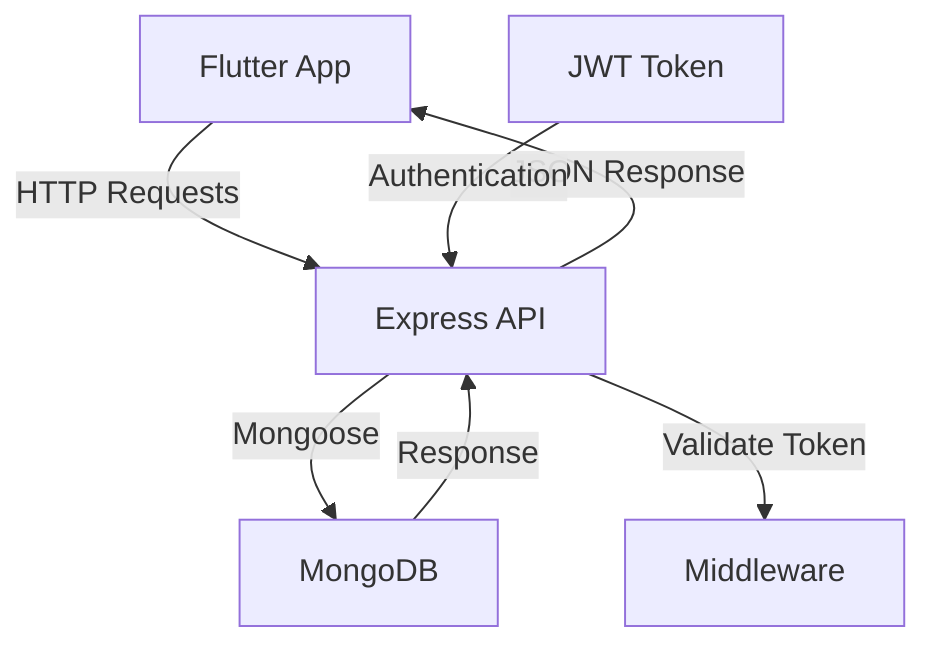

# 🏗️ Arquitetura do PlanTour

## Visão Geral

O PlanTour segue uma arquitetura em camadas, separando claramente as responsabilidades entre frontend e backend.

## Backend (API RESTful)

### Tecnologias
- **Node.js**: Runtime JavaScript
- **Express.js**: Framework web
- **MongoDB**: Banco de dados NoSQL
- **Mongoose**: ODM para MongoDB
- **JWT**: Autenticação
- **bcryptjs**: Criptografia de senhas

### Estrutura de Camadas

```
├── src/
│   ├── config/        # Configurações (banco, env)
│   ├── modelos/       # Schemas do MongoDB
│   ├── controladores/ # Lógica de negócio
│   ├── rotas/         # Definição de endpoints
│   ├── middlewares/   # Autenticação, validação
│   ├── servicos/      # Serviços externos
│   └── utils/         # Funções auxiliares
```

#### Modelos (Schemas)
- **Usuario**: Dados do usuário, preferências
- **Destino**: Informações de locais turísticos
- **Roteiro**: Planejamentos de viagem
- **Avaliacao**: Reviews e ratings

#### Endpoints Principais
```
/api/auth/          # Autenticação
/api/users/         # Usuários
/api/destinos/      # Destinos turísticos
/api/roteiros/      # Roteiros de viagem
/api/avaliacoes/    # Avaliações
```

## Frontend (Flutter)

### Tecnologias
- **Flutter**: Framework UI
- **Dart**: Linguagem de programação
- **Provider**: Gerenciamento de estado
- **HTTP**: Requisições para API

### Estrutura de Camadas

```
├── lib/
│   ├── telas/        # Interfaces de usuário
│   ├── componentes/  # Widgets reutilizáveis
│   ├── modelos/      # Modelos de dados locais
│   ├── servicos/     # Comunicação com API
│   ├── estado/       # Gerenciamento de estado
│   └── utils/        # Constantes, estilos, helpers
```

#### Telas Principais
- **Autenticação**: Login, cadastro, recuperação
- **Home**: Dashboard principal
- **Explorar**: Descobrir destinos
- **Roteiros**: Planejar e visualizar viagens
- **Perfil**: Configurações do usuário

## Fluxo de Dados



## Segurança

- **Autenticação JWT**: Tokens seguros
- **Criptografia**: Senhas com bcryptjs
- **Validação**: Middleware de validação
- **CORS**: Controle de origem

## Performance

- **Caching**: Imagens e dados frequentes
- **Lazy Loading**: Carregamento sob demanda
- **Paginação**: Para listas grandes
- **Compressão**: Otimização de requests

## Escalabilidade

- **Microserviços**: Possível divisão futura
- **Load Balancing**: Para múltiplas instâncias
- **CDN**: Para assets estáticos
- **Database Sharding**: Para grandes volumes